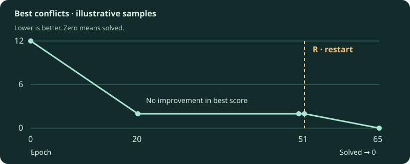

The solver searches a population of possible boards for one with no attacking queens. It uses a genetic algorithm, with optional local search to improve promising candidates.

## A board is a permutation

Each entry gives the row of the queen in that column. Every row appears exactly once, so queens cannot share a row or column. Only diagonal conflicts remain. Two queens conflict when their column distance equals their row distance.

The solver's arrays use zero-based positions. GUI coordinates use one-based row and column labels.

## One epoch at a time

<ol class="algorithm-flow" aria-label="One evolution epoch">
  <li><strong>Select</strong>Choose parents</li>
  <li><strong>Crossover</strong>Combine permutations</li>
  <li><strong>Mutate</strong>Swap queen rows</li>
  <li><strong>Local search</strong>Optional improving swaps</li>
  <li><strong>Survive</strong>Keep elites and sample</li>
  <li><strong>Measure</strong>Refresh diversity and record</li>
</ol>

Repeat until solved, cancelled, or out of epochs. A soft restart can replenish the population before the next epoch's selection.

1. **Select parents.** Roulette selection uses fitness weights; tournament selection chooses the best candidate from a random group. Parents come from the population at the start of mating.
2. **Create offspring.** Partially mapped crossover (PMX) combines two parent permutations while retaining one queen per row and column.
3. **Mutate.** Swap row positions in selected non-elite chromosomes to explore other boards.
4. **Improve locally, if enabled.** Try random swaps and keep improvements in a configured fraction of non-elite candidates.
5. **Select survivors.** Keep elites and sample other survivors to return to the target population size.
6. **Measure and refresh.** Recalculate fitness and diversity. If too many boards are duplicates, refresh non-elites with random permutations, then record the epoch's metrics.

The initial population is recorded as **epoch zero**. The best board found so far is retained across epochs.

## When progress stalls

Stagnation counts epochs without improving the best conflict score. As it increases, the solver adjusts mutation and elite rates to encourage exploration. At the restart threshold, a **soft restart** preserves a small elite group and replenishes the population before continuing evolution.

A diversity refresh and a soft restart are different events. **R** markers in GUI charts identify actual soft-restart epochs.

## Reading the metrics

| Metric | Meaning |
| --- | --- |
| Best conflicts | Best conflict sum found so far. Zero means solved. Each attacking pair contributes to both queens' counts. |
| Average conflicts | Mean conflict sum of the current population. |
| Diversity ratio | Unique board permutations divided by population size. |
| Mutation / elite ratio | The rates applied for that epoch, including adaptive changes. |
| Stagnation epochs | Epochs since the latest improvement or stagnation reset. |
| Local-search improvements | Candidates improved by local search during the epoch. |
| Restart count | Cumulative soft restarts completed so far. |

The GUI retains a bounded sample of history. A line between retained points does not mean every intermediate epoch was kept. [The GUI guide](../gui/#read-the-charts) explains chart sampling and exports.

## An example of a stalled run

The following trace is **illustrative, not a measured benchmark**. The restart epoch varies with the configured budget and stagnation history.

| Epoch | Best conflicts | Average conflicts | Diversity | What to notice |
| ---: | ---: | ---: | ---: | --- |
| 0 | 12 | 18 | 90% | The initial population is evaluated. |
| 20 | 2 | 8 | 45% | A better board has been found. |
| 50 | 2 | 4 | 18% | Best score is flat; the population has become less diverse. |
| 51 | 2 | 10 | 80% | **R:** a restart introduces varied boards; the best score is preserved. |
| 65 | 0 | 6 | 70% | One board solves the problem. The population average need not reach zero. |

A lower diversity ratio alone does not prove that a restart happened. Use the explicit marker. Hover values show retained samples; line segments between samples are not extra measurements.

## A concrete conflict count

On a 4×4 board, permutation `[0, 2, 1, 3]` has two attacking pairs: columns 1 and 4 share a diagonal, as do columns 2 and 3 (using GUI's one-based labels). Every queen has one conflict, so the total conflict sum is **4**, not 2. A solved permutation such as `[1, 3, 0, 2]` has sum **0**.

## Why use multiple seeds?

A seed makes a run reproducible for the same implementation and dependencies. It does not show whether a setting works well across different starting populations. Compare multiple seeds by solve rate, then runtime and solved epoch.

[Choose parameters →](../tuning/) · [Inspect measured results →](../benchmarks/)
