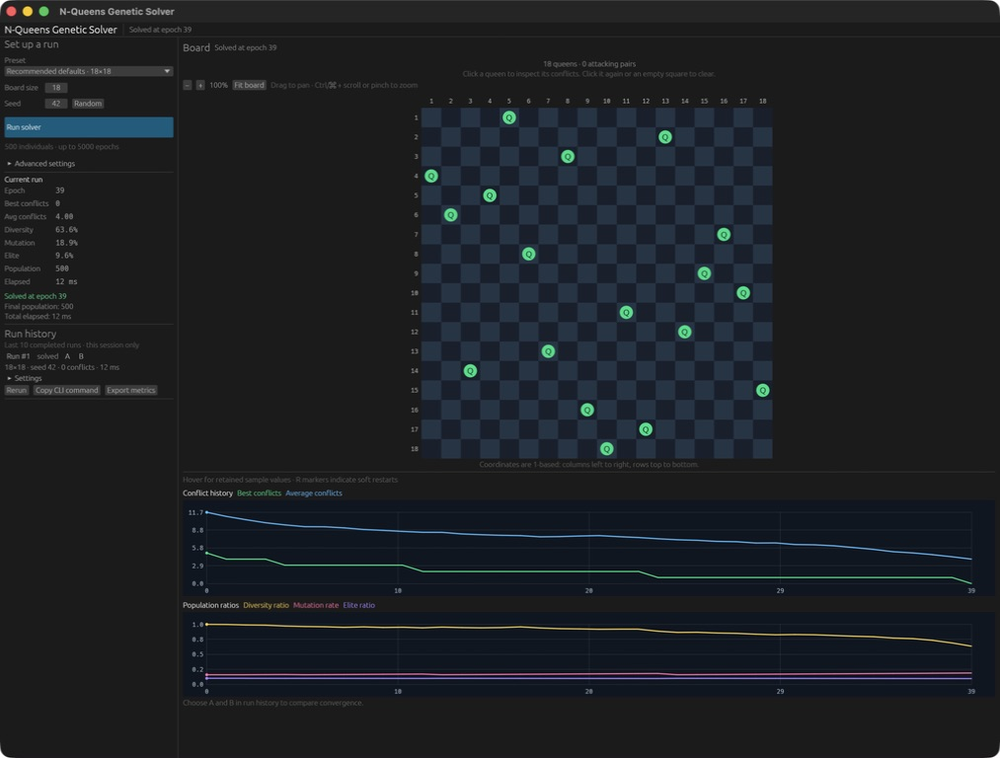

import { CardGrid, LinkCard } from '@astrojs/starlight/components';
import LegacyDocsLinks from '../../components/LegacyDocsLinks.astro';

<LegacyDocsLinks />

  Native desktop GUI
  Seeded experiments
  Rust library + CLI

## See the desktop solver

*Recommended defaults · 18×18, seed 42: solved at epoch 39. Captured on macOS; runtime varies by machine.*

[Run the desktop GUI](./gui/) to inspect boards and compare your own experiments.

## Choose your starting point

<CardGrid>
  <LinkCard title="Run the GUI" href="./gui/" description="Watch convergence, inspect attacking queens, and compare runs side by side." />
  <LinkCard title="Use the CLI" href="./cli/" description="Choose a seed, configure a run, and export metrics for your experiments." />
  <LinkCard title="Understand the algorithm" href="./algorithm/" description="Follow a board through selection, crossover, mutation, and survival." />
  <LinkCard title="Find better settings" href="./tuning/" description="Balance exploration and local search, then test your changes across seeds." />
</CardGrid>

## From your first board to your next experiment

Start with a small 8×8 board. Then explore a larger search, compare configurations, or use the solver in your own Rust code.

<CardGrid>
  <LinkCard title="Benchmarks and profiling" href="./benchmarks/" description="Compare measured N=18 presets and see where the solver spends its time." />
  <LinkCard title="Build with the library" href="./library/" description="Receive epoch updates, request cancellation, and inspect run outcomes." />
</CardGrid>

New to the project? [Build and run your first board](./getting-started/). Contributing? [See the development checks](./development/).
